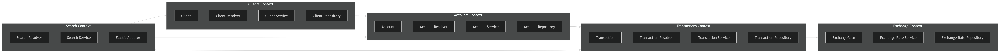

## Description

Proyecto de transacciones bancarias, con servicios para clientes, cuentas y movimientos con depósitos, retiros y transferencias, soportando múltiples monedas (DOP, USD, EUR).

## Architecture
Es un proyecto diseñado como un modular monolith en NestJS, inspirado en DDD ligero, con separación por bounded contexts: Clients, Accounts, Transactions, Exchange y Search.

Cada módulo sigue una estructura por capas: presentation, application, domain e infrastructure.

PostgreSQL actúa como fuente de datos transaccional, Redis se usa para caching, y ElasticSearch para búsquedas.

### System Architecture


### Layered Architecture


### Domain Contexts



## Project setup

```bash
$ npm install
```

## Compile and run the project

```bash
# development
$ npm run start

# watch mode
$ npm run start:dev

# production mode
$ npm run start:prod
```

## Run tests

```bash
# unit tests
$ npm run test

# e2e tests
$ npm run test:e2e

# test coverage
$ npm run test:cov
```

## Deployment


```bash
$ npm install -g @nestjs/mau
$ mau deploy
```


