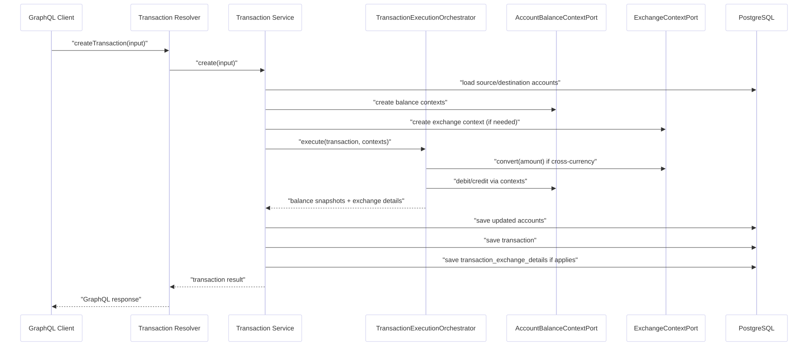

# Banking Service

Backend en NestJS para una prueba técnica de banco digital con clientes, cuentas, transacciones y cambio de moneda.

## Stack

- Node.js + NestJS + TypeScript
- GraphQL code-first
- PostgreSQL + TypeORM + migraciones
- Redis para caching
- ElasticSearch para búsqueda
- Docker Compose para app e infraestructura
- Postman para pruebas manuales

## Módulos

- `clients`
  - alta, consulta, actualización, búsqueda y eliminación de clientes
- `accounts`
  - manejo de cuentas bancarias por cliente y moneda
- `transactions`
  - depósitos, retiros, transferencias y reversa
  - snapshots de balance antes y después en la transacción
- `exchange`
  - tasas de cambio y conversión entre `DOP`, `USD` y `EUR`
  - detalle FX persistido en `transaction_exchange_details` cuando aplica
- `health`
  - endpoint `GET /health` para estado básico del servicio y dependencias

## Arquitectura

El proyecto sigue un modular monolith con separación por capas dentro de cada módulo:

- `presentation`
  - resolvers GraphQL y controllers HTTP
- `application`
  - servicios de caso de uso, DTOs, orquestación, puertos y contextos
- `domain`
  - entidades, enums, reglas y tipos del dominio
- `infrastructure`
  - repositorios TypeORM, cache, búsqueda e integración técnica

### Enfoque DDD

La solución sigue un enfoque pragmático de Domain-Driven Design dentro de un modular monolith:

- cada módulo encapsula su propio lenguaje y reglas principales
- la lógica de negocio intenta vivir en `domain`
- la coordinación entre módulos ocurre en `application`
- infraestructura técnica queda aislada en `infrastructure`

No es un DDD purista en todos los puntos, pero sí mantiene una separación clara entre:

- reglas del dominio
- orquestación de casos de uso
- persistencia e integraciones técnicas

### Bounded Contexts

Los bounded contexts implementados son:

- `clients`
  - identidad y datos base del cliente
- `accounts`
  - cuentas, balance y reglas propias de fondos
- `transactions`
  - intención y ejecución de movimientos financieros
- `exchange`
  - tasas de cambio y conversión entre monedas
- `health`
  - estado operativo del servicio

Relaciones relevantes entre contextos:

- `accounts` depende de `clients` a nivel de persistencia por `clientId`
- `transactions` coordina con `accounts` para aplicar débito y crédito
- `transactions` coordina con `exchange` cuando una transferencia requiere conversión de moneda

Decisiones importantes de diseño:

- `transactions` no actualiza balances a mano desde reglas dispersas
- la ejecución del movimiento se coordina en un orquestador de aplicación
- `accounts` conserva la responsabilidad del balance real de cuenta a través de su contexto de aplicación
- `exchange` expone un contexto y un puerto para resolver conversiones sin acoplar `transactions` a detalles de infraestructura

## Diagramas

### Arquitectura por capas


Lectura correcta frente al código actual:

- representa bien la separación `presentation -> application -> domain / infrastructure`
- `Health Controller` ya existe y está implementado
- `Repository Contracts`, `TypeORM Repositories`, `Redis Cache` y `ElasticSearch` coinciden con el proyecto
- el flujo real no es literalmente `Entities -> Application`; las entidades viven en `domain` y son usadas desde `application`

### Arquitectura del sistema



Lectura correcta frente al código actual:

- representa bien que la app expone GraphQL y `/health`
- PostgreSQL, Redis y ElasticSearch sí forman parte del runtime
- ajuste importante:
  - en la implementación real, el acceso a PostgreSQL, Redis y ElasticSearch se hace desde `infrastructure`, no directamente desde `domain`

### Contextos de dominio


Lectura correcta frente al código actual:

- `clients`, `accounts`, `transactions` y `exchange` existen como contextos o módulos
- `transactions` sí depende funcionalmente de `accounts` y `exchange`
- ajuste importante:
  - no existe un `Search Resolver`; la búsqueda es soporte de infraestructura vía `SearchService`
  - el diagrama es una vista conceptual; el código final además usa:
    - `AccountBalanceContextPort`
    - `ExchangeContextPort`
    - `TransactionExecutionOrchestrator`
    - `transaction_exchange_details` como tabla hija para FX

### Flujo de transacciones


Este diagrama sí coincide con la solución final:

- el resolver delega al servicio de transacciones
- el servicio usa un orquestador de aplicación
- el orquestador resuelve efectos financieros y conversión si aplica
- el balance se actualiza en cuentas
- el detalle FX se persiste por separado cuando hay cambio de moneda

### Integración Exchange y Transactions



Este diagrama refleja el caso de uso más importante del módulo `exchange`:

- una transferencia entre monedas distintas consulta tasas
- calcula el monto convertido
- aplica el débito y crédito correctos
- persiste el detalle de la conversión

## Reglas de negocio principales

- un cliente no puede duplicarse por email o documento
- una cuenta no puede duplicarse por número de cuenta
- una transacción no puede duplicarse por referencia
- depósitos acreditan a la cuenta origen
- retiros debitan de la cuenta origen
- transferencias debitan origen y acreditan destino
- si una transferencia es entre distintas monedas, se resuelve conversión a través del módulo `exchange`
- el detalle FX se guarda solo cuando aplica
- una transacción `COMPLETED` no se elimina
- la reversa revierte el movimiento financiero

## Persistencia

Tablas principales:

- `clients`
- `accounts`
- `transactions`
- `exchange_rates`
- `transaction_exchange_details`
- `migrations`

Notas:

- el proyecto usa migraciones versionadas
- `synchronize` está deshabilitado
- un arranque limpio depende de ejecutar correctamente todas las migraciones

## Variables de entorno

Usa `.env.example` como referencia:

```env
PORT=3000
DB_HOST=localhost
DB_PORT=5432
DB_USER=postgres
DB_PASSWORD=postgres
DB_NAME=banking
REDIS_HOST=localhost
REDIS_PORT=6379
ELASTICSEARCH_NODE=http://localhost:9200
```

## Ejecución con Docker

Levantar toda la solución:

```bash
docker compose up --build
```

Servicios disponibles:

- app: `http://localhost:3000`
- GraphQL: `http://localhost:3000/graphql`
- health: `http://localhost:3000/health`
- PostgreSQL: `localhost:5432`
- Redis: `localhost:6379`
- ElasticSearch: `localhost:9200`

Si necesitas limpiar completamente la base y cache:

```bash
docker compose down -v
docker compose up --build
```

## Ejecución local sin Docker para la app

Levanta dependencias:

```bash
docker compose up -d postgres redis elasticsearch
```

Instala dependencias:

```bash
npm install
```

Ejecuta migraciones:

```bash
npm run migration:run
```

Inicia la app:

```bash
npm run start:dev
```

## Migraciones

Scripts principales:

```bash
npm run migration:generate
npm run migration:create
npm run migration:run
npm run migration:revert
```

Notas:

- `migration:generate` ayuda, pero siempre debe revisarse manualmente
- las migraciones incluidas ya contemplan `clients`, `accounts`, `transactions`, `exchange_rates` y `transaction_exchange_details`

## Seed

Script disponible:

```bash
npm run seed
```

Estado actual:

- el seed existente cubre clientes base
- todavía conviene ampliarlo con cuentas multi-moneda y tasas de cambio para una demo más completa

## Caching y búsqueda

Caching:

- se usa Redis cuando está disponible
- si Redis no está disponible, el sistema hace fallback a memoria
- temporalmente, los `Get By Id` leen directo desde base de datos para evitar inconsistencias por payloads viejos en cache

Búsqueda:

- ElasticSearch se usa como primer intento
- si ElasticSearch no responde, se hace fallback a PostgreSQL
- `Get By Id` y `Search` son responsabilidades separadas

## Health Check

Endpoint:

```http
GET /health
```

Ejemplo:

```json
{
  "service": "banking-service",
  "status": "ok",
  "timestamp": "2026-03-10T20:00:00.000Z",
  "dependencies": {
    "database": "up",
    "cache": "redis",
    "search": "up"
  }
}
```

## Postman

Colección y environment:

- `postman/banking-service.postman_collection.json`
- `postman/local.postman_environment.json`

La colección cubre:

- `health`
- `clients`
- `accounts`
- `exchange`
- `transactions`

Orden recomendado para pruebas end-to-end:

1. `Health Check`
2. `Create Client`
3. `Create Account`
4. `Create Destination Account`
5. `Create Deposit Completed`
6. `Create Withdrawal Completed`
7. `Create Transfer Completed`
8. `Create DOP to USD Rate`
9. `Create FX Destination Account`
10. `Create FX Transfer DOP to USD`
11. `Get Transaction By Id`
12. `List Transactions`

## Scripts útiles

```bash
npm run build
npm run lint
npm run format
npm run test
npm run test:e2e
npm run test:cov
npm run migration:run
npm run seed
```

