# Banking Service

Backend en NestJS para una prueba tecnica de banco digital con clientes, cuentas, transacciones y cambio de moneda.

## Stack

- Node.js + NestJS + TypeScript
- GraphQL code-first
- PostgreSQL + TypeORM + migraciones
- Redis para caching
- ElasticSearch para busqueda
- Docker Compose para app e infraestructura
- Postman para pruebas manuales

## Modulos

- `clients`
  - alta, consulta, actualizacion, busqueda y eliminacion de clientes
- `accounts`
  - manejo de cuentas bancarias por cliente y moneda
- `transactions`
  - depositos, retiros, transferencias y reversa
  - snapshots de balance antes y despues en la transaccion
- `exchange`
  - tasas de cambio y conversion entre `DOP`, `USD` y `EUR`
  - detalle FX persistido en `transaction_exchange_details` cuando aplica
- `health`
  - endpoint `GET /health` para estado basico del servicio y dependencias

## Arquitectura

El proyecto se organizo por modulos de negocio con separacion por capas dentro de cada modulo:

- `presentation`
  - resolvers GraphQL y controllers HTTP
- `application`
  - servicios de caso de uso, DTOs, orquestacion, puertos y contextos
- `domain`
  - entidades, enums, reglas y tipos del dominio
- `infrastructure`
  - repositorios TypeORM, cache, busqueda e integracion tecnica

## Diagramas

### Arquitectura del sistema



### Arquitectura por capas


### Contextos de dominio


### Flujo de transacciones


## Reglas de negocio principales

- un cliente no puede duplicarse por email o documento
- una cuenta no puede duplicarse por numero de cuenta
- una transaccion no puede duplicarse por referencia
- depositos acreditan a la cuenta origen
- retiros debitan de la cuenta origen
- transferencias debitan origen y acreditan destino
- si una transferencia es entre distintas monedas, se resuelve conversion a traves del modulo `exchange`
- el detalle FX se guarda solo cuando aplica
- una transaccion `COMPLETED` no se elimina
- la reversa revierte el movimiento financiero

## Persistencia

Tablas principales:

- `clients`
- `accounts`
- `transactions`
- `exchange_rates`
- `transaction_exchange_details`
- `migrations`

Notas:

- el proyecto usa migraciones versionadas
- `synchronize` esta deshabilitado
- un arranque limpio depende de ejecutar correctamente todas las migraciones

## Variables de entorno

Usa `.env.example` como referencia:

```env
PORT=3000
DB_HOST=localhost
DB_PORT=5432
DB_USER=postgres
DB_PASSWORD=postgres
DB_NAME=banking
REDIS_HOST=localhost
REDIS_PORT=6379
ELASTICSEARCH_NODE=http://localhost:9200
```

## Ejecucion con Docker

Levantar toda la solucion:

```bash
docker compose up --build
```

Servicios disponibles:

- app: `http://localhost:3000`
- GraphQL: `http://localhost:3000/graphql`
- health: `http://localhost:3000/health`
- PostgreSQL: `localhost:5432`
- Redis: `localhost:6379`
- ElasticSearch: `localhost:9200`

Si necesitas limpiar completamente la base y cache:

```bash
docker compose down -v
docker compose up --build
```

## Ejecucion local sin Docker para la app

Levanta dependencias:

```bash
docker compose up -d postgres redis elasticsearch
```

Instala dependencias:

```bash
npm install
```

Ejecuta migraciones:

```bash
npm run migration:run
```

Inicia la app:

```bash
npm run start:dev
```

## Migraciones

Scripts principales:

```bash
npm run migration:generate
npm run migration:create
npm run migration:run
npm run migration:revert
```

Notas:

- `migration:generate` ayuda, pero siempre debe revisarse manualmente
- las migraciones incluidas ya contemplan `clients`, `accounts`, `transactions`, `exchange_rates` y `transaction_exchange_details`

## Seed

Script disponible:

```bash
npm run seed
```

Estado actual:

- el seed existente cubre clientes base
- conviene ampliarlo con cuentas multi-moneda y tasas de cambio para una demo mas completa

## Caching y busqueda

Caching:

- se usa Redis cuando esta disponible
- si Redis no esta disponible, el sistema hace fallback a memoria
- temporalmente, los `Get By Id` leen directo desde base de datos para evitar inconsistencias por payloads viejos en cache

Busqueda:

- ElasticSearch se usa como primer intento
- si ElasticSearch no responde, se hace fallback a PostgreSQL
- `Get By Id` y `Search` son responsabilidades separadas

## Health Check

Endpoint:

```http
GET /health
```

Ejemplo:

```json
{
  "service": "banking-service",
  "status": "ok",
  "timestamp": "2026-03-10T20:00:00.000Z",
  "dependencies": {
    "database": "up",
    "cache": "redis",
    "search": "up"
  }
}
```

## Postman

Coleccion y environment:

- `postman/banking-service.postman_collection.json`
- `postman/local.postman_environment.json`

La coleccion cubre:

- `health`
- `clients`
- `accounts`
- `exchange`
- `transactions`

Orden recomendado para pruebas end-to-end:

1. `Health Check`
2. `Create Client`
3. `Create Account`
4. `Create Destination Account`
5. `Create Deposit Completed`
6. `Create Withdrawal Completed`
7. `Create Transfer Completed`
8. `Reverse Transfer`
9. `Create DOP to USD Rate`
10. `Create FX Destination Account`
11. `Create FX Transfer DOP to USD`
12. `Get Transaction By Id`
13. `List Transactions`

## Scripts utiles

```bash
npm run build
npm run lint
npm run format
npm run test
npm run test:e2e
npm run test:cov
npm run migration:run
npm run seed
```
